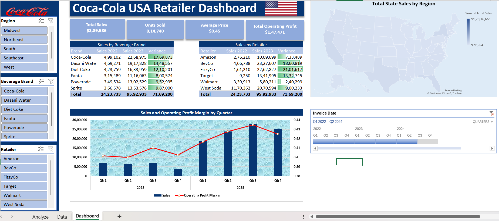
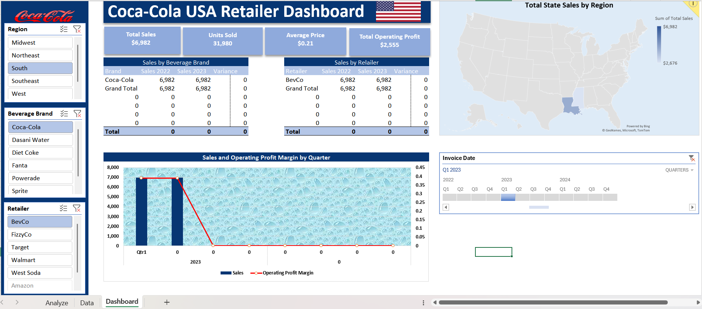
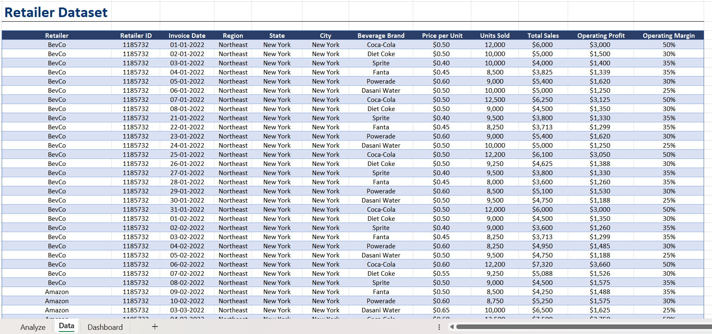

# Coca-Cola-USA-retailer-dashboard

This Excel dashboard provides insights into Coca-Cola's sales performance, operating profit margins, and regional trends, helping retailers and stakeholders make data-driven decisions.

## Dashboard Overview

## Dynamic Slicers

## Features
- **Sales by Beverage Brand:** A table showing sales performance for various Coca-Cola products, with year-over-year variance.
  

- **Sales by Retailer:** Highlights total sales and growth across major retailers like Amazon, Walmart, and Target.

- **Regional Sales Distribution:** A map visualizing total sales by U.S. regions, enabling geographic performance analysis.

- **Sales and Profit Margins by Quarter:** A combined chart showcasing sales trends and operating profit margins over time.

## Tools Used
- **Excel:** For creating an interactive and visually detailed dashboard.
- **Data Processing:** Cleaned and transformed raw data to ensure accurate insights.

## Key Insights
- Dasani Water and FizzyCo saw the highest year-over-year sales growth among Coca-Cola brands and retailers, respectively.
- Midwest and Southeast regions reported the highest total sales figures.
- Q3 consistently demonstrates strong sales and profit margins, offering opportunities for targeted marketing campaigns.
